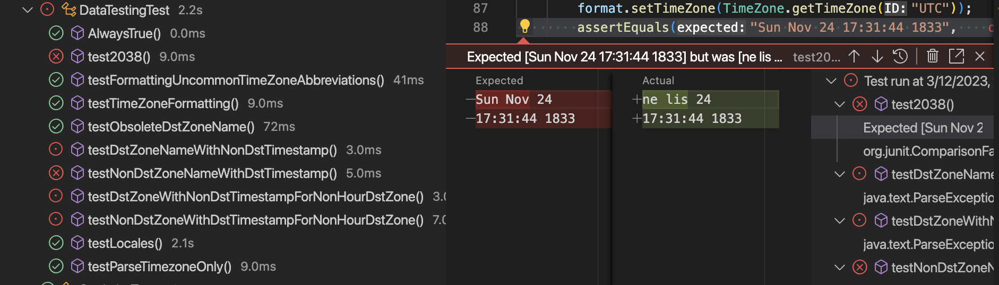

# UnitTesting-JUnit
We wrote tests for Java structure, classes etc. to learn JUnit (w/ hamcrest) and Apache Maven project setup. 

We can test by command line command
```
mvn clean test
```
and get output
  
for all in tests run in /test/java/cz/stkl/app folder.
# I. TreeMap<K,V> tests
main/.. **App.java** & test/.. **AppTest.java**
- public void InsertFourUniqueTestKeys()  
- public void Insert7UniqueTestSize7()  
- public void Insert3But2SameKeyTestRecentOnKey()  
- public void Insert50DeleteAllTestSize0() 


# II. Custom structure - interfaces, more complex functions
Interface Employees   
```java
    int add(String name, int salary); // returns ID
    Set<Integer> getAll(); // returns a set of IDs
    String getName(int id);
    int getSalary(int id);
    void changeSalary(int id, int newSalary);
```
Functions for Statistics - that have to be tested
```java
    int computeAverageSalary();
    int getMinSalary();
    void printSalariesByName(); // prints the list of pairs <name, salary> that is sorted by employee names
```
Encapsulation and implementation of dummy scenario is as follows:  
**Person.java** -> **People.java** implements Employees -> **Statistics.java**(ctor (object&: Employees))  
Then StatisticsTest.java runs there JUnit tests:  
- AverageOf3Salaries()  
- MinSalaryOf5()  
- Sort5GuysPrint()  

  
# III. Some data stuff fiddle
For this task I found some tests which were run on Android devices. I studied the format assumptions and some of the failing tests. The main reason was different degion localization.  

This has nothing in src/main/java/cz/stkl/app/DateTesing.java since nothing was implemented and everything in src/test/java/cz/stkl/app/DataTestingJava.java